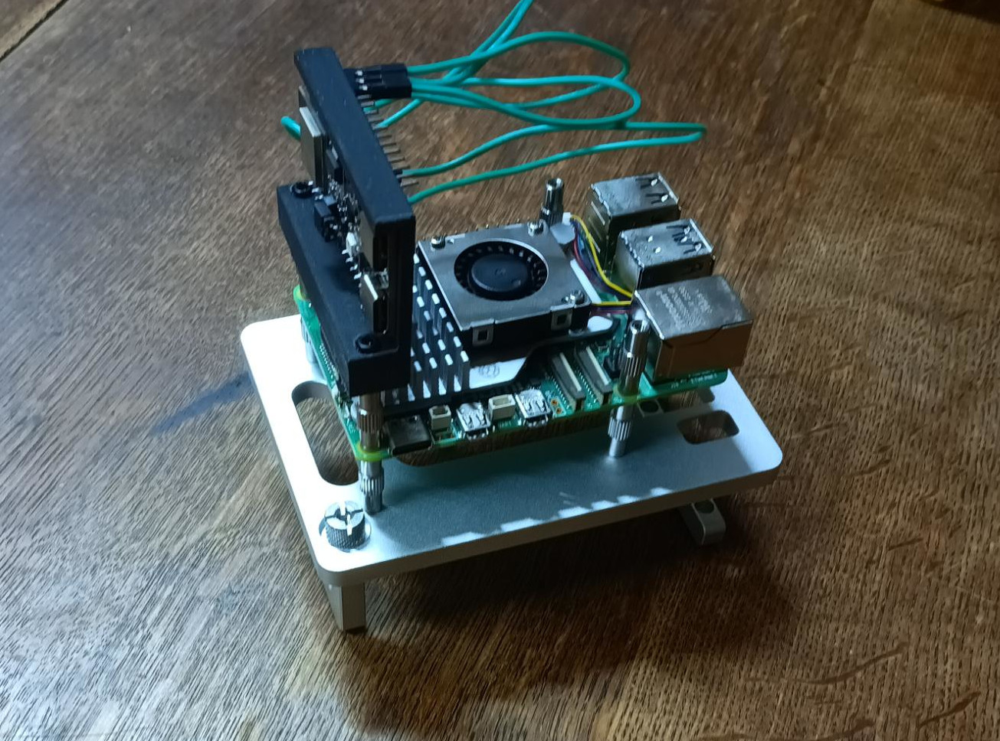

# DIY Thread Border Router


A complete solution for building your own Thread Border Router using Raspberry Pi 5 and ESP32-H2, with integrated monitoring and visualization tools.

## What is a Thread Border Router?

<div style="float:left; margin-right:16px; background:white; padding:8px; border-radius:6px; width:fit-content; display:inline-block;">
  
</div>

---

source: [openthread.io](https://openthread.io/codelabs/openthread-border-router)

<br>

A Thread Border Router connects Thread devices to other networks like Wi-Fi or Ethernet, enabling smart home devices to communicate across network boundaries. This project provides:

- **Hardware**: Raspberry Pi 5 + ESP32-H2 radio module
- **Software**: OpenThread Border Router with observability stack
- **Documentation**: Step-by-step guides for setup and operation




## Quick Start

1. **Set up hardware**: Connect ESP32-H2 to Raspberry Pi following the [Setup Guide](./docs/setup.md)
2. **System setup**: Run `sudo task setup-raspberry-pi` to prepare your system
3. **Prepare firmware**: Run `task flash-esp32h2` to program the ESP32-H2
4. **Launch services**: Run `task start` to start all containers
5. **Access interfaces**:
   - Thread Border Router: `http://<raspberry-pi-ip>:80`
   - Monitoring Dashboard: `http://<raspberry-pi-ip>:3000`
   - Network Visualizer: `http://<raspberry-pi-ip>:8081`

See the [Getting Started Guide](./docs/setup.md) for detailed instructions.

## Documentation

- [Getting Started & Hardware Setup](./docs/setup.md) - Hardware assembly and initial configuration
- [Firmware Guide](./docs/firmware.md) - Flashing and customizing ESP32-H2 firmware
- [Configuration Guide](./docs/configuration.md) - Configuring the Thread Border Router stack
- [Operation & Usage](./docs/operation.md) - Day-to-day operation and management
- [Device Commissioning](./docs/device-commissioning.md) - Adding devices to your Thread network
- [Monitoring & Observability](./docs/monitoring.md) - Using Grafana dashboards and visualization
- [Troubleshooting](./docs/troubleshooting.md) - Solving common issues

For detailed documentation, see the [docs/](./docs) directory.

## Features

- **Ready-to-use firmware**: Pre-built ESP32-H2 OpenThread RCP firmware with simple flashing
- **Containerized deployment**: Complete stack defined in Docker Compose
- **Web interfaces**: Multiple UIs for different management and monitoring needs
- **Unified task system**: All operations integrated into a single Taskfile for consistent management
- **Comprehensive monitoring**: Integrated Prometheus and Grafana dashboards
- **Network visualization**: Real-time Thread network topology view
- **Network diagnostics**: Built-in tools for Thread network testing and troubleshooting

## System Architecture

The system consists of several integrated components:

```
┌─────────────────────────────────────────┐
│              Raspberry Pi 5             │
│                                         │
│  ┌───────────────┐    ┌───────────────┐ │
│  │   OpenThread  │    │  Monitoring   │ │
│  │ Border Router │    │     Stack     │ │
│  └───────┬───────┘    └───────────────┘ │
│          │                              │
└──────────┼──────────────────────────────┘
           │
           │ UART/SPI
           │
┌──────────┼────────────────────────────┐
│          │                            │
│  ┌───────▼───────┐                    │
│  │   ESP32-H2    │                    │
│  │  (802.15.4    │                    │
│  │    Radio)     │                    │
│  └───────────────┘                    │
│                                       │
│              Hardware                 │
└───────────────────────────────────────┘
```

## Prerequisites

### Hardware
- Raspberry Pi 5 (4GB+ RAM recommended) with Raspberry Pi OS Bookworm
- ESP32-H2 development board (ESP32-H2-DevKitC or equivalent)
- USB-to-UART adapter (if not built into ESP32-H2 board)
- Power supply for Raspberry Pi (3A+ recommended)
- Ethernet connection (for initial setup and better reliability)

### Software
- Raspberry Pi OS Bookworm (64-bit recommended)
- Docker and Docker Compose ([installation guide](./docs/setup.md#software-setup))
- Task task runner ([taskfile.dev](https://taskfile.dev))

## Contributing

Contributions are welcome! Please check our [contribution guidelines](./CONTRIBUTING.md) for details on how to submit issues, feature requests, and pull requests.

## License

This project is licensed under the MIT License - see the [LICENSE](./LICENSE) file for details.
